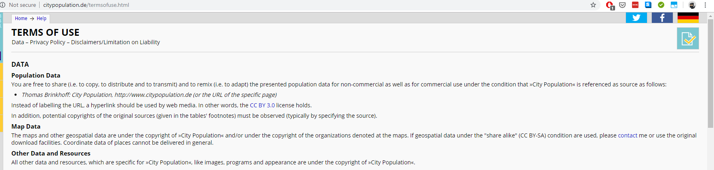

# Web Scraping and EDA in Python 3 using Requests, BeautifulSoup, Pandas, Matplotlib, Seaborn

In this jupyter notebook I documented web scraping and exploratory data analysis using Python 3.

The process is as follows:
   1. use Python's requests and bs4 libraries to scrape a webpage
   2. load the scraped data into a pandas dataframe
   3. do some basic exploratory data anlaysis on the dataframe
   4. basic visualization

For this article's purpose I scraped population data of New Zealand as of June 30, 2018 from http://citypopulation.de website. 

## Source:
# Source: 
## Thomas Brinkhoff: City Population, http://www.citypopulation.de

***Please note there might be some policies and rules for a website for using the data. So before you do the web scraping please do not forget to read the data usage policies.***

Data use policy: http://citypopulation.de/termsofuse.html (DATA -> Population Data)

### The data that I will be extracting in this jupyter notebook is for Oceania -> NEW ZEALAND http://citypopulation.de/en/newzealand/
- I am only scraping data for North and South Islands (excluded Chatham islands)
- North island: http://citypopulation.de/en/newzealand/northisland/
- South island: http://citypopulation.de/en/newzealand/southisland/

# Final note

Please note that I documented this jupyter notebook for a simple way to explain how useful it is to scrape website data using requests and BeautifulSoup (bs4) libraries.

Feel free to do your own exploration and analysis on the data that is scraped. 

I hope that this piece of work will give readers some basic understanding of web scraping and intuition behind the analysis, which is:
- from scraping data to end-to-end data analysis (if I might say in simple words)
